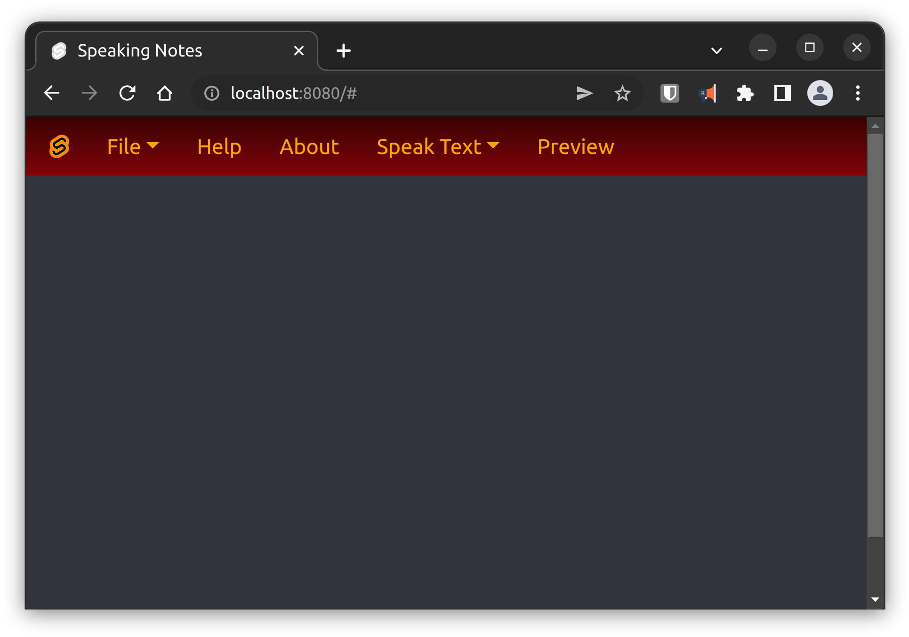

# Speaking Notes Svelte

Demo-Project for learning purpose. A simple Markdown-Editor, written with Svelte.
Provide accessibility for visual-impared users.

## ToDo:
- add "Save File"
- add "Clear Editor"
- update Wiki
## Dependencies

- Svelte
- Sveltestrap
- Svelte-SPA-router
- Marked
- Web-Speech-Api

## Read more: Speaking-Notes-WIKI:
[WIKI](WIKI.md)

## Learning sources:

- https://stackoverflow.com/questions/65649357/svelte-pass-useaction-to-component-child

- [YouTube: Svelte and Speech-Synthesis-API](https://www.youtube.com/watch?v=XDdKWOqCcZk)
- [GitHub: phptuts](https://github.com/phptuts/speechsynthesissvelte)

- [YouTube: Codeevolution, Svelte components](https://www.youtube.com/watch?v=v943IElHCeY)
- [YouTube: dcode Svelte tutorial](https://www.youtube.com/playlist?list=PLVvjrrRCBy2KpGl3-s_ELqKd4hiNCN6yz)

